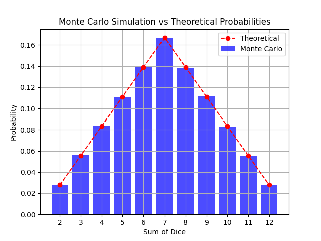

# Monte Carlo Simulation of Dice Roll Probabilities

This program simulates rolling two six-sided dice using the Monte Carlo method to calculate the probabilities of each
possible sum. The results are then compared with the theoretical probabilities.

## Monte Carlo Results

The following graph displays the probabilities of each sum obtained from the Monte Carlo simulation:

## Results

The probabilities for the sum of two six-sided dice are as follows:

| Sum | Theoretical Probability | Measured Probability | Difference |
|-----|-------------------------|----------------------|------------|
| 2   | 2.78%                   | 2.7721%              | -0.0079%   |
| 3   | 5.56%                   | 5.5773%              | 0.0173%    |
| 4   | 8.33%                   | 8.3868%              | 0.0568%    |
| 5   | 11.11%                  | 11.0800%             | -0.0300%   |
| 6   | 13.89%                  | 13.8999%             | 0.0099%    |
| 7   | 16.67%                  | 16.6396%             | -0.0304%   |
| 8   | 13.89%                  | 13.8493%             | -0.0407%   |
| 9   | 11.11%                  | 11.1448%             | 0.0348%    |
| 10  | 8.33%                   | 8.2989%              | -0.0311%   |
| 11  | 5.56%                   | 5.5671%              | 0.0071%    |
| 12  | 2.78%                   | 2.7842%              | 0.0042%    |

## Conclusion

The Monte Carlo simulation results closely match the theoretical probabilities, demonstrating the accuracy of the
simulation method. The slight variations are due to the randomness inherent in the Monte Carlo method, but with a large
number of simulations (1,000,000 in this case), the results converge to the theoretical values.